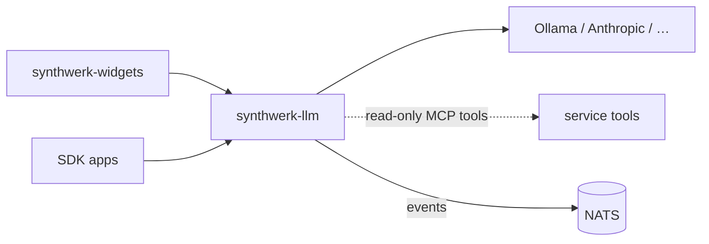

# synthwerk-llm

**Synthwerk** · LLM gateway — local models in dev, any provider in prod

## In 30 seconds

- One API for chat and text tasks. Provider chosen by env: Ollama locally, Anthropic or others in production.
- Scopes: platform-admin, tenant, user. Services enforce data scope on the token, never the prompt.
- Streams tokens over SSE. Every answer and tool call is audited.

## Where it fits

- Ecosystem map: [synthwerk](https://github.com/VelimirMueller/synthwerk).
- Shared CI, lint configs and templates: [synthwerk-blueprint](https://github.com/VelimirMueller/synthwerk-blueprint).

## Status

| Item | State |
|---|---|
| Rewrite | Planned in epic **E3 Chat vertical slice** |
| Old code | Tag [`legacy-final`](../../tree/legacy-final): a Flask + GPT4All WebSocket demo (one shared session for all users) |
| Branching | `main` deploys to dev, a `vX.Y.Z` tag to stg, an approved digest to prd |

- This repo was renamed. The old URL still redirects here.
