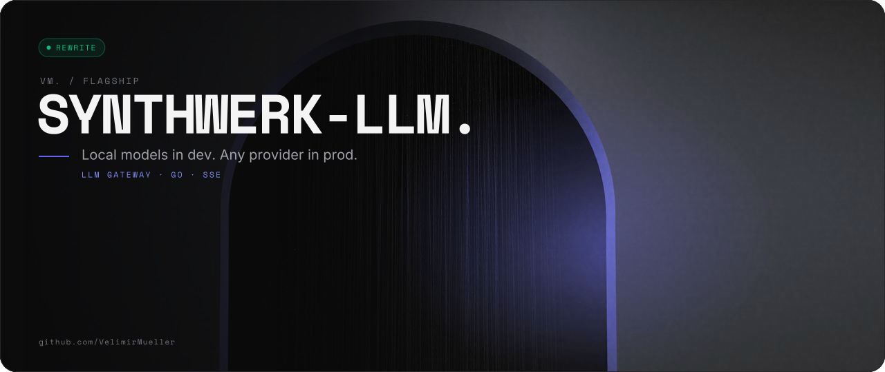
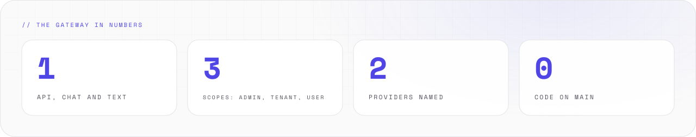
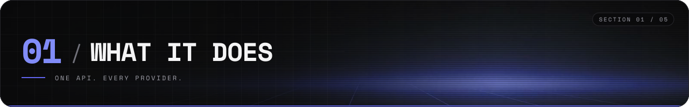
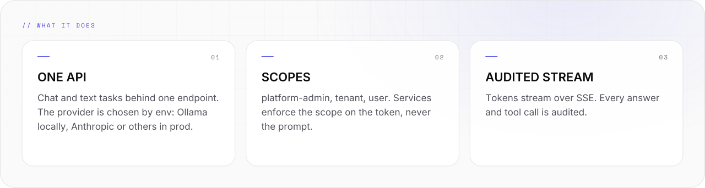
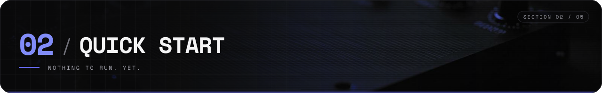
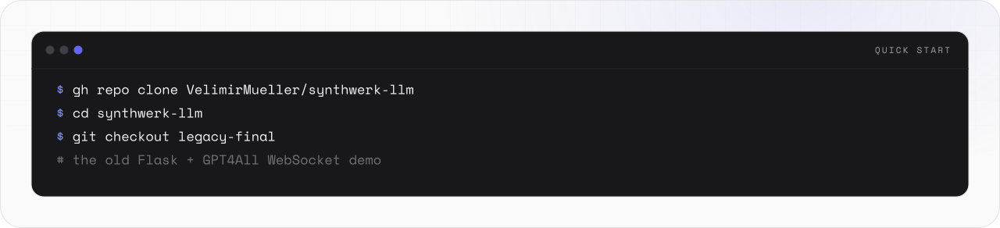
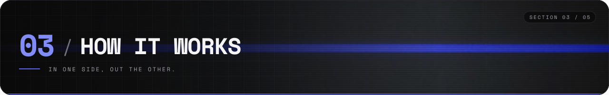
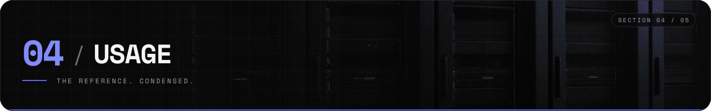
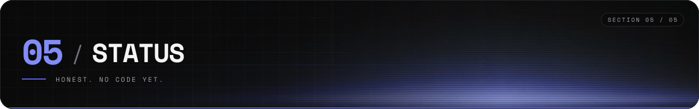
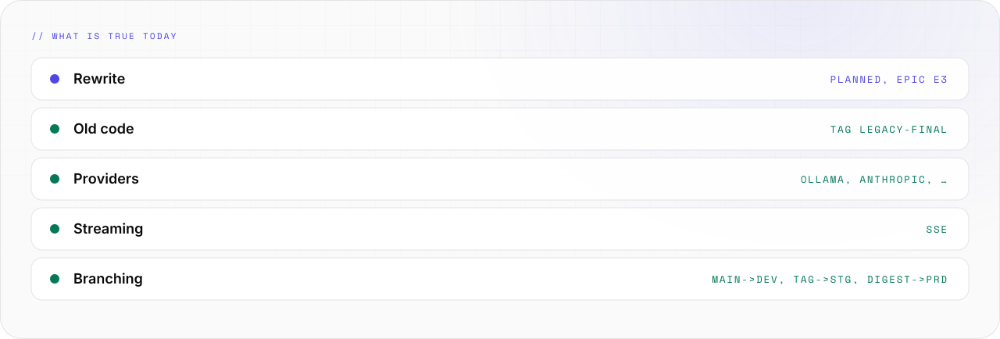

<picture>
  <source media="(prefers-color-scheme: light)" srcset="assets/banner/hero-v2-light.svg">
  
</picture>

<p align="center">

[](#-05-status) [](https://github.com/VelimirMueller) [](LICENSE) [](#-05-status)

</p>

> Local models in dev. Any provider in prod.

```text
 █████  ██  ██  ██  ██  ██████  ██  ██  ██   ██  ██████  █████   ██  ██
██      ██  ██  ███ ██    ██    ██  ██  ██   ██  ██      ██  ██  ██ ██
 ████    ████   ██████    ██    ██████  ██ █ ██  █████   █████   ████
    ██    ██    ██ ███    ██    ██  ██  ███████  ██      ██ ██   ██ ██
█████     ██    ██  ██    ██    ██  ██   ██ ██   ██████  ██  ██  ██  ██

██      ██      ██   ██
██      ██      ███ ███
██      ██      ███████
██      ██      ██ █ ██
██████  ██████  ██   ██  ██

------ the llm gateway for the synthwerk family ------------------------
```

**synthwerk-llm** is the LLM gateway for the Synthwerk family. One API for chat and text tasks, scoped access, audited streaming.
This repo is being rewritten. There is no code on main. It is very good at waiting.

<picture>
  <source media="(prefers-color-scheme: dark)" srcset="assets/readme/stats-v2-dark.svg">
  
</picture>

<br>

## // 01 WHAT IT DOES



<picture>
  <source media="(prefers-color-scheme: dark)" srcset="assets/readme/features-v2-dark.svg">
  
</picture>

- One API for chat and text tasks. The provider is chosen by env: Ollama in dev, Anthropic or any provider in prod.
- Tokens stream over SSE. Every answer and tool call is audited.
- Scopes are platform-admin, tenant and user. The service enforces the scope on the token, never the prompt.

<br>

## // 02 QUICK START



<picture>
  <source media="(prefers-color-scheme: dark)" srcset="assets/readme/start-v2-dark.svg">
  
</picture>

There is no code to run on main yet. The old demo lives at the tag `legacy-final`.

```bash
gh repo clone VelimirMueller/synthwerk-llm
cd synthwerk-llm
git checkout legacy-final   # the old Flask + GPT4All WebSocket demo
```

- The ecosystem map is in [synthwerk](https://github.com/VelimirMueller/synthwerk).
- Shared CI, lint configs and templates come from [synthwerk-blueprint](https://github.com/VelimirMueller/synthwerk-blueprint).

<br>

## // 03 HOW IT WORKS



<picture>
  <source media="(prefers-color-scheme: dark)" srcset="assets/readme/flow-v2-dark.svg">
   LLM GATEWAY -> PROVIDERS -> NATS BUS. The gateway also reads the other services through read-only MCP tools." src="assets/readme/flow-v2-light.svg" width="100%">
</picture>

```text
 feat/* --PR + checks--> main --auto--> dev --tag vX.Y.Z--> stg
                                                             |
                                          prd <--manual------+
                                               approval

 trunk-based. no env branches. digest promoted by approval.
```

- **Clients in.** synthwerk-widgets and SDK apps call the gateway over HTTP.
- **Provider out.** The gateway forwards to Ollama, Anthropic or another provider, chosen by env.
- **Read-only MCP.** The gateway reads the other services through read-only MCP tools. It never writes.
- **Events out.** Facts go to the NATS bus as events.

<br>

## // 04 USAGE



### Scopes

- platform-admin, tenant, user. Enforced on the token, never the prompt.

### Where it fits

- synthwerk-widgets and SDK apps call the gateway.
- The gateway reads service tools through read-only MCP tools.
- The gateway publishes events to the NATS bus.
- Ecosystem map: [synthwerk](https://github.com/VelimirMueller/synthwerk). Shared CI: [synthwerk-blueprint](https://github.com/VelimirMueller/synthwerk-blueprint).

### The old code

- Tag `legacy-final`: a Flask + GPT4All WebSocket demo, one shared session for all users.
- This repo was renamed. The old URL still redirects here.

### Branching

- main deploys to dev, a `vX.Y.Z` tag to stg, an approved digest to prd.

<br>

## // 05 STATUS



<picture>
  <source media="(prefers-color-scheme: dark)" srcset="assets/readme/status-v2-dark.svg">
  
</picture>

There are no tests. There is no code to test. There is no CHANGELOG yet.

<br>

```text
-- EOF ------------------------------------------- NO CODE. YET. --
```

---

<sub>VM. studio / flagship · open source · look per <code>vm-brand</code> playbook · [MIT](LICENSE) © 2026 Velimir Mueller</sub>
